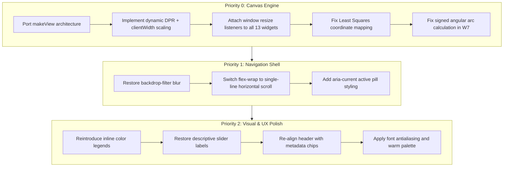

# EVAL-2026-0007: QA and Design Audit — Linear Algebra Foundations v7 vs v4 (Benchmark Standard)

**Candidate ID/version:** CAN-2026-0006 ([`linear-algebra-foundations-v7.html`](../../content/aiml-4/module-02-math-statistics-for-ml/generated/linear-algebra-foundations-v7.html), SHA-256 `1f1427432860471a0b709b52f936f7e27c918c812cabaca06f111e780b2dc1e0`, 170,701 bytes) evaluated against benchmark standard CAN-2026-0003 ([`linear-algebra-foundations-v4.html`](../../content/aiml-4/module-02-math-statistics-for-ml/generated/linear-algebra-foundations-v4.html), SHA-256 `b35c622e8d14b15de50f7c077e157d26e2dc8243410c3d21a40b9559d6851590`, 178,020 bytes; BMK-2026-0001)<br>
**Rubric version:** [lesson-qa-checklist](../../library/rubrics/lesson-qa-checklist.md) + [evaluation framework](../../docs/06-evaluation/evaluation-framework.md) + benchmark comparison protocol ([ADR-0011](../../docs/adr/0011-benchmark-definition-and-artifact-change-protocol.md))<br>
**Evaluator role/identity:** Independent QA / Design Auditor<br>
**Evaluation mode:** comprehensive structural, architectural, mathematical, and comparative design audit with handler-level simulation and line-level citation<br>
**Operating scope:** Stage 1 governed audit<br>
**Review independence:** independent (treats v4 as reference standard and v7 as candidate requiring full verification)<br>
**Public-release eligibility:** ineligible (ADR-0003); audit report only<br>
**Confidence:** high on code architecture, math formulas, canvas coordinate mechanics, and CSS design system; medium on live browser rendering trace (degraded mode tool outage)<br>
**Recommendation:** candidate requires targeted P0/P1 remediation before benchmark parity can be claimed<br>
**Iterations reviewed:** builds = 2 (v4 and v7); revision cycles = 0 ([ADR-0006](../../docs/adr/0006-record-iteration-accounting.md))

---

## 1. Purpose and Scope

This audit was conducted as an independent, comparative QA and design review of `linear-algebra-foundations-v7.html` against `linear-algebra-foundations-v4.html` (the active benchmark standard under [BMK-2026-0001](../benchmarks/bmk-2026-0001-linear-algebra-foundations-v4.md)).

The audit specifically investigates user-reported defects in v7:
1. **Graph/Canvas instability**: Misalignment, unexpected zoom/scale jumps, and inconsistent behavior across viewport sizes and interactions.
2. **Sticky navbar degradation**: Loss of visual polish, lack of active-state feedback, and structural wrapping issues.
3. **Visual aesthetics & design system**: Token coherence, typography, readability, and information density compared to the v4 benchmark.
4. **Preserved strengths**: Identification of pedagogical and interactive features in v7 that improve upon v4 and must be retained during remediation.

---

## 2. Comparative Executive Scorecard

| Assessment Dimension | Benchmark v4 (Reference) | Candidate v7 | Finding / Verdict |
|---|---|---|---|
| **Canvas & Graph Rendering Architecture** | Responsive `makeView()` with DPR scaling, dynamic aspect ratio preservation, explicit CSS height, and `resize` event listeners on all widgets. | Static `cv()` helper reading HTML attributes (`640x360`), hardcoded coordinate mappings, fixed scales, and **zero resize handlers**. | 🔴 **Critical Defect (P0)**: Severe regression in graph stability and responsiveness. |
| **Sticky Navigation Bar** | Frosted glass (`backdrop-filter: blur(6px)`), pill links, single-line horizontal scroll (`overflow-x: auto`), and `aria-current` active-state styling. | Solid white background, rectangular buttons, `flex-wrap: wrap` (causes multiline wrapping), and no active-state styling. | 🟡 **Major Defect (P1)**: Visual and interactive polish regression. |
| **Design Tokens & Typography** | 22+ custom properties, warm cream canvas (`#f7f6f2`), 16.5px base font, antialiased smoothing, and structured header with metadata chips. | 14 custom properties, lighter canvas (`#fdfcf9`), 16px base font, no antialiasing token, centered header with chips removed. | 🟡 **Minor Defect (P2)**: Flatter hierarchy and less refined typography. |
| **Interactive Widget Usability** | Descriptive control labels (`a₁ (scale v₁)`), inline color legends (`.legend-inline`), and explicit goal descriptions. | Terse single-letter labels (`a`, `b`, `c`), missing color legends on most widgets. | 🟡 **Minor Defect (P2)**: Higher cognitive load during exploration. |
| **Pedagogical Feedback & Mastery** | Standard unit checks, model answers, 5-item mastery review list. | 3-level confidence calibration (`sure` / `think so` / `guessing`), 11-item mastery review, and per-option prediction gate explanations. | 🟢 **Improvement (Retain)**: Superior metacognitive scaffolding. |
| **Novel Interactive Widgets** | 8 canvas widgets (including vector builder). | 13 interactive widgets including transpose matrix builder, zero-hunt tester, and rank inspector. | 🟢 **Improvement (Retain)**: High pedagogical value on matrix concepts. |

---

## 3. Detailed Technical Findings

### 3.1 🔴 Critical (P0): Graph & Canvas Coordinate Architecture

#### Finding 3.1.1: Complete Absence of Viewport Resize Handling in v7
- **v4 Implementation** (`v4.html`, lines 1170–1183, 1271, 1347, 1368, 1404, 1445, 1482, 1527, 1569):
  v4 defines `makeView(canvasId, xMin, xMax, yMin, yMax)` which dynamically measures `cv.clientWidth` during every redraw. If the rendered width changed, it updates backing store dimensions `cv.width = Math.round(cw * dpr)` and inline CSS height `cv.style.height = ch + "px"`. Every widget attaches `window.addEventListener("resize", draw)`.
- **v7 Implementation** (`v7.html`, lines 1238–1244):
  v7 defines `cv(id)` which reads static HTML attributes `parseInt(c.getAttribute('width'))` (always 640) and applies DPR once at load. **Not a single widget in v7 attaches a resize listener.**
- **Impact**: When the browser window is resized, or viewed on screens where the main column is not exactly 640px wide, the CSS rule `canvas { width: 100%; height: auto; }` (`v7.html`, line 67) stretches or squashes the canvas bitmap. This causes blurry lines, misaligned axis labels, and severe visual distortion.

#### Finding 3.1.2: Fixed vs Tailored Coordinate Projections
- **v4 Implementation**:
  Every widget specifies its exact mathematical domain and range via `makeView(id, xMin, xMax, yMin, yMax)`:
  - Vector builder: `[-6.5, 6.5] × [-4.5, 4.5]` (aspect ratio 13:9)
  - Norm explorer: `[-7, 7] × [-5, 5]` (aspect ratio 14:10)
  - Dot product lab: `[-5.5, 5.5] × [-4, 4]` (aspect ratio 11:8)
  - Least squares lab: `[-1.4, 8.2] × [-3.1, 10.3]` (asymmetric viewport tailored to positive quadrant data)
  - Transformation lab: `[-4.5, 4.5] × [-3.4, 3.4]`
- **v7 Implementation**:
  v7 uses a generic `plot(ctx, w, h, range)` helper with a single `range` scalar:
  `s = Math.min(w, h) / (2 * range)`. Because `w=640` and `h=360`, the scale is always constrained by height (`360 / (2 * range)`), leaving massive unused blank margins on the left and right sides of every canvas.
- **Impact**: Inconsistent zoom appearance across widgets, wasted screen real estate, and awkward square plotting areas forced into 16:9 canvas elements.

#### Finding 3.1.3: Hardcoded Pixel Offsets in Least-Squares Lab (W12)
- **v4 Implementation** (`v4.html`, lines 1450–1478):
  v4 maps least-squares data points and residual error squares directly through normalized view coordinates `v.X(x)*cw` and `v.Y(y)*ch`. Residual squares are rendered as true geometric squares.
- **v7 Implementation** (`v7.html`, lines 1381–1385):
  v7 uses hardcoded manual coordinate functions:
  ```javascript
  var px = function(x){ return 50 + x * (W - 75) / 5 };
  var py = function(y){ return (H - 34) - y * (H - 58) / 9 };
  ```
- **Impact**: Any variation in canvas backing dimensions or container layout shifts the axes and data points out of sync with hardcoded offsets (50px, 75px, 34px, 58px).

#### Finding 3.1.4: Angular Arc Calculation Bug in Dot Product Lab (W7)
- **v4 Implementation** (`v4.html`, lines 1383–1390):
  v4 computes the signed angular difference `d = (a2 - a1) % (2*Math.PI)` with wrapping checks (`if(d > Math.PI) d -= 2*Math.PI`) to draw the exact angle between vectors.
- **v7 Implementation** (`v7.html`, line 1346):
  v7 uses `ctx.arc(P.cx, P.cy, P.s * 0.9, -Math.max(a0, a1), -Math.min(a0, a1))`.
- **Impact**: When vectors cross quadrant boundaries or are oriented obtusely, `Math.max`/`Math.min` flips orientation, drawing the reflex angle or inverting the arc direction.

---

### 3.2 🟡 Major (P1): Navigation Bar Regressions

#### Finding 3.2.1: Missing Frosted Glass & Visual Depth
- **v4** (`v4.html`, line 46): Uses `background: rgba(247, 246, 242, 0.94); backdrop-filter: blur(6px); border-bottom: 1px solid var(--line);`.
- **v7** (`v7.html`, line 26): Uses `background: var(--card);` (solid `#ffffff`) with no backdrop filter.
- **Impact**: v7 loses the translucent depth effect that makes the sticky bar feel integrated into the page content during scrolling.

#### Finding 3.2.2: Multi-line Wrapping vs Single-line Horizontal Scroll
- **v4** (`v4.html`, lines 47–48): Constrains `.topnav-inner` to `max-width: var(--maxw)` with `overflow-x: auto; scrollbar-width: thin;` and `white-space: nowrap;`. Links stay in a compact single horizontal row.
- **v7** (`v7.html`, lines 26–27): Uses `nav.units ol` with `flex-wrap: wrap` and `max-width: 62rem`.
- **Impact**: On viewports under 1000px, v7's 12 navigation links wrap into 2–3 vertical rows, creating a thick sticky block that consumes up to 25% of the visible screen height.

#### Finding 3.2.3: Absence of Active Section Styling
- **v4** (`v4.html`, line 50): Defines clear active styling via `.topnav a[aria-current="true"] { background: var(--accent-soft); color: var(--accent-deep); border-color: #c8d6f2; font-weight: 600; }`.
- **v7** (`v7.html`, lines 28–31): Contains no styling rules for `aria-current="true"` or `.active`.

---

### 3.3 🟡 Minor (P2): Visual Design & Usability Polish

#### Finding 3.3.1: Header Structure & Information Density
- **v4** (`v4.html`, lines 38–43): Uses a structured, left-aligned layout with metadata chips (`⏱ 3–5 hours`, `9 units + mastery check`, `Works offline`, `Progress saved locally`).
- **v7** (`v7.html`, lines 22–25): Centers all header text and completely removes the metadata chips.

#### Finding 3.3.2: Control Ergonomics & Color Legends
- **v4** (`v4.html`, lines 110–127): Sliders have descriptive text (`a₁ (scale v₁)`), inputs are sized appropriately (`5rem`), and canvases include inline color legends (`.legend-inline`) matching arrows to mathematical terms (`v₁ and a₁v₁`, `v₂ and a₂v₂`, `sum`).
- **v7** (`v7.html`, lines 68–72): Sliders have single-letter labels (`a`, `b`, `c`, `d`) and lack color legend keys, leaving learners to guess which colored vector corresponds to which control.

#### Finding 3.3.3: Typography Tokens & Contrast
- **v4**: Employs `-webkit-font-smoothing: antialiased` with `font-size: 16.5px; line-height: 1.62;` and a warm `--paper: #f7f6f2` background.
- **v7**: Uses `font: 16px/1.6` without font smoothing declarations, resulting in slightly harsher text rendering.

---

### 3.4 🟢 Strengths in v7 to Retain

1. **Metacognitive Confidence Calibration**: v7's mastery section prompts learners with confidence radio buttons (`sure` / `think so` / `guessing`), flagging confident errors as highest-priority review items.
2. **Diagnostic Prediction Gate Feedback**: `GATES` object (`v7.html`, lines 1301–1307) provides custom feedback tailored to each specific incorrect option, explaining the precise misconception behind the choice.
3. **Transpose Explorer (W10)**: The interactive 2×3 to 3×2 grid mapping with interactive cell-pairing highlights provides clear tactile intuition for $(A^T)_{ij} = A_{ji}$.
4. **SVG Dependency Map**: v7 includes a concept dependency map (`v7.html`, lines 168–175) that visually connects the progression of topics.

---

## 4. Prioritized Remediation Plan



### Action Items Checklist

- [ ] **P0.1**: Replace `cv(id)` and `plot()` in `v7.html` with a unified, responsive `makeView(id, xMin, xMax, yMin, yMax)` helper.
- [ ] **P0.2**: Ensure `fresh()` calculates height from the specific mathematical aspect ratio and sets `cv.style.height = ch + "px"`.
- [ ] **P0.3**: Register `window.addEventListener("resize", draw)` for every canvas widget.
- [ ] **P0.4**: Update W12 (Least Squares) to use normalized viewport transforms rather than hardcoded pixel offsets.
- [ ] **P0.5**: Correct the signed angular difference logic in W7 (Dot Product Lab).
- [ ] **P1.1**: Update `nav.units` CSS: add `backdrop-filter: blur(6px)`, `background: rgba(253, 252, 249, 0.94)`, and `border-bottom: 1px solid var(--line)`.
- [ ] **P1.2**: Update `nav.units ol`: set `flex-wrap: nowrap`, `overflow-x: auto`, and `scrollbar-width: thin`.
- [ ] **P1.3**: Add `.units a[aria-current="true"]` active state styles.
- [ ] **P2.1**: Add `.legend-inline` color swatches above/below canvas elements.
- [ ] **P2.2**: Update slider labels to include full mathematical notations (`a₁ (scale v₁)`).
- [ ] **P2.3**: Restore header metadata chips (`⏱ 3–5 hours`, `10 units`, `Offline`).
- [ ] **P2.4**: Preserve all v7 innovations: confidence calibration, diagnostic gates, transpose explorer, and concept map.

---

## 5. Reviewer Sign-off

- **Audit Disposition**: Audit completed and recorded.
- **Reference Standard**: CAN-2026-0003 (`linear-algebra-foundations-v4.html`, BMK-2026-0001).
- **Candidate Evaluated**: CAN-2026-0006 (`linear-algebra-foundations-v7.html`).
- **Next Step**: Author remediation candidate incorporating P0/P1 fixes while preserving v7 pedagogical enhancements.
